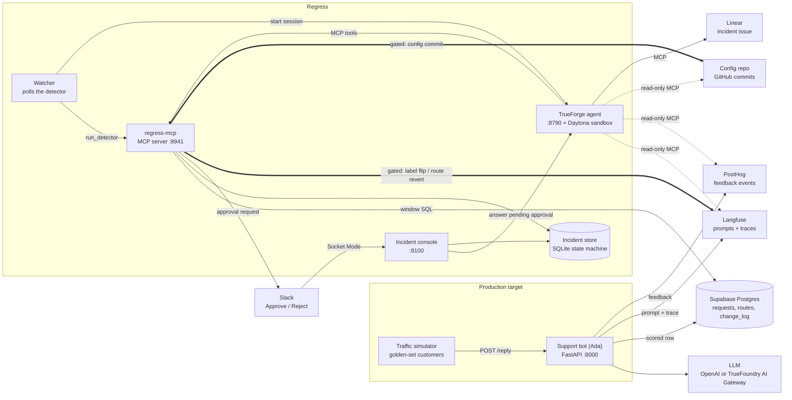

# Regress

An on-call agent for LLM apps.
When a support bot quietly gets worse after a prompt, model or route change, Regress finds what changed, proves it caused the regression by replaying real traffic, and puts it back only after a human approves.

> "Our support bot got worse after someone changed something. Find it, prove it, put it back, ask me first."

LLM regressions are silent.
A "tone refresh" to a prompt can stop fraud reports from reaching a human while every answer still reads fine, nothing returns a 500 and nobody is paged.
Regress watches scored production traffic, detects the shift with plain statistics, and hands the investigation to an agent that must back every claim with evidence and ask before it touches production.

## Contents

- [How it works](#how-it-works)
- [Architecture](#architecture)
- [Safety policy](#safety-policy)
- [Repository layout](#repository-layout)
- [Local setup](#local-setup)
- [Running Regress](#running-regress)
- [Triggering a regression](#triggering-a-regression)
- [Tests](#tests)
- [Troubleshooting](#troubleshooting)
- [Further reading](#further-reading)
- [Prior art and acknowledgements](#prior-art-and-acknowledgements)

## How it works

1. **The system under test.** Ada is a fintech support bot (FastAPI).
   It fetches the prompt labelled `production` from Langfuse and the model from the `support` route, answers from a 20-entry FAQ, and scores every reply deterministically against a 40-item golden set (format, escalation, citations, content).
   Each reply becomes one row in Supabase Postgres, a trace in Langfuse and feedback events in PostHog.
2. **Traffic.** Simulated customers from the golden set ask questions all day and react to the answers: thumbs down when an answer fails its checks, "talk to a human" when it needed escalation and did not get it.
3. **Detection is arithmetic, not an LLM opinion.** One SQL query compares the current 5-minute window with the previous 2 hours using robust z-scores (median and MAD, with a MAD floor) over eval score, format validity, escalation, citations, refusals, provider errors, p50 and p95 latency, and cost per request.
   An alarm needs |z| > 3.5, enough volume and a real effect size.
   Known incident periods are masked out of the baseline.
4. **The watcher** polls the detector and, when it opens an incident, starts a session for the `regress` agent in TrueForge.
5. **The agent investigates** by following the `regress-runbook` skill:
   it localises the alarm to a segment (prompt version or model), fans out four parallel subagents (what changed, segments, customer impact, replay), and writes and runs replay code in a Daytona sandbox.
   It reads the chatbot's config history from GitHub, prompts and traces from Langfuse, and customer impact from PostHog.
6. **Four correlation gates** decide whether a cause may be claimed:
   onset within 10 minutes of the change, replay reproduces the gap on the same inputs, excluding the segment removes the alarms, and no competing change landed in the window.
   `NOT_LOCALIZED` and `INSUFFICIENT_DATA` are legitimate endings.
7. **Evidence-only narration.** Every number is an evidence row that carries the query behind it.
   The agent writes figures only as `{{ev_id}}` placeholders, and a validator rejects any text with a bare number, so the report cannot state a figure it cannot back.
8. **One gated write.** If the gates pass, the proposal is frozen, a Linear issue is filed and the agent asks for approval in Slack and the incident console.
   Only after a human approves does it flip the prompt label or revert the route, commit the change to the config repo and verify recovery on fresh production traffic.
   A short before/after video of the real bot UI shows what customers saw.

## Architecture



An interactive version of this diagram lives in [docs/architecture/regress.html](docs/architecture/regress.html).

### Components

| Component | Code | Port | Role |
|---|---|---|---|
| Support bot | [target/bot/app.py](target/bot/app.py) | 8000 | The production LLM app being watched. Serves the chat UI, `POST /reply`, `POST /feedback`, `GET /healthz`. |
| Traffic | [target/traffic.py](target/traffic.py) | | Golden-set customers asking questions and reacting to the answers. |
| Fault switches | [target/faults.py](target/faults.py), [scripts/](scripts) | | Make a real change to what the bot runs (prompt label or route) and commit it to the config repo. |
| regress-mcp | [regress_mcp/server.py](regress_mcp/server.py) | 8941 | MCP server (streamable HTTP at `/mcp`) with the detector, localisation, replay, gates, validator, state machine and the two gated writes. |
| Incident store | [regress_mcp/store.py](regress_mcp/store.py) | | SQLite at `.regress/state.sqlite`: incidents, transitions, evidence and replays. |
| Watcher | [agent/watcher.py](agent/watcher.py) | | Polls `run_detector` and starts a TrueForge session per new incident. |
| Agent bootstrap | [agent/bootstrap.py](agent/bootstrap.py) | | Idempotently registers the connectors, the runbook skill and the `regress` agent in TrueForge. |
| Runbook skill | [skills/regress-runbook/](skills/regress-runbook) | | The procedure, subagent contracts and replay harness template the agent follows. |
| Incident console | [console/app.py](console/app.py) | 8100 | Operator view of signals, incidents, evidence, commits and videos, plus the decision card. Receives Slack button clicks over Socket Mode. |

### Incident state machine

The state machine is enforced in code ([regress_mcp/store.py](regress_mcp/store.py)), not in prompts.
Every transition writes a row that names the evidence it rests on.

```
detected -> planned -> replayed -> not_localized
                                -> checkpointed (gates passed, proposal frozen)
                                     -> approved -> applied -> verified | verify_failed
                                     -> denied | conflict
```

### regress-mcp tools

| Kind | Tools |
|---|---|
| Reads | `get_window_stats`, `get_changes`, `get_traces`, `get_user_signals`, `get_route`, `get_prompt`, `get_incident`, `get_evidence` |
| Analysis | `run_detector`, `record_plan`, `localize`, `replay_generate`, `get_replay_outputs`, `submit_replay_report`, `check_gates`, `validate_narrative` |
| Communication | `request_approval`, `post_update`, `record_decision`, `capture_customer_view` |
| Gated writes | `rollback_execute`, `route_revert` |
| Verification | `verify_recovery` |

## Safety policy

- **Reads are free.** Every external connector the agent gets is limited to an explicit allowlist: Langfuse, PostHog and GitHub are read-only (GitHub may comment on existing issues), and Linear can only file, comment on and close the incident issue.
- **Exactly one production write per incident, and it always waits for a human.** `rollback_execute` and `route_revert` are configured with `require_approval_for_tools` in TrueForge.
- **The write must match the frozen proposal.** Both tools refuse to run unless the incident is `checkpointed` and the arguments equal the proposal frozen when the gates passed, so the approval card shows exactly what will change.
- **A failed gate can never reach approval.** `check_gates` recomputes everything from stored facts and re-scores the agent's replay report; if the numbers disagree the report is rejected.
- **No double flips.** Before writing, the action reads the live state: still `from` means apply, already `to` means mark applied, anything else is `conflict`. A kill between approval and apply is safe.
- **Nothing is deleted.** Prompt versions are never deleted; a rollback moves a label.
- **Decisions are locked.** The console and Slack share one decision path; the first decision takes a lock and a second click from either surface is refused, naming who decided.
- **"No" is a first-class answer.** A rejection is recorded with its reason, the agent names the next branch it would investigate, and stops.
- **Recovery is verified on fresh production traffic,** never on the replay, and only on requests served by the restored version.

## Repository layout

```
target/            the system under test: bot, scorer, KB, golden set, prompts, seed, traffic, fault switches
  bot/             FastAPI app, the shared LLM call, deterministic scoring, chat UI
  sql/             Postgres schema (golden_set, routes, requests, change_log)
regress_mcp/       the MCP server: detector, localisation, replay, gates, narrative validator, actions, store
agent/             TrueForge bootstrap, watcher, preflight, session tailing and approval fallback
console/           incident console, decision path, Slack Socket Mode handler
skills/            the regress-runbook skill published to TrueForge
scripts/           one-line fault and revert switches
tests/             pytest suite
docs/              design, playbook, demo runbook, learnings, Slack app manifest, architecture diagram
```

## Local setup

### Prerequisites

| Tool | Why |
|---|---|
| Python 3.11+ and [uv](https://docs.astral.sh/uv/) | Runs everything in this repo. |
| Node.js (for `npx`) | Runs TrueForge locally. |
| [GitHub CLI](https://cli.github.com/) `gh`, logged in | Publishes the runbook skill; also supplies a GitHub token if `GITHUB_TOKEN` is empty. |
| Docker (optional) | Runs the bot and traffic as containers instead. |

### Accounts and services

| Service | Needed for | What to create |
|---|---|---|
| OpenAI (or the TrueFoundry AI Gateway) | The bot, replays and the agent | An API key with credits. A full agent run uses about 700k tokens, mostly cached. |
| Supabase | Telemetry | A project; copy the **transaction pooler** URI (port 6543). |
| Langfuse Cloud | Prompts and traces | A project with a public and secret key. |
| PostHog | Customer feedback signals | Project API key (`phc_...`) for capture; personal API key (`phx_...`) with `query:read` and the numeric project id for reads. |
| GitHub | Config history | An empty repo you own to act as the chatbot's config repo, and a public repo for the runbook skill. |
| TrueForge + Daytona | Running the agent | A model provider and a Daytona sandbox provider configured in TrueForge. |
| Slack (optional) | Approve and Reject buttons | An app created from [docs/slack-app-manifest.yaml](docs/slack-app-manifest.yaml). |
| Linear (optional) | Incident issues | A personal API key and a team. |

Slack and Linear are optional: without them the agent skips those steps and you approve from the console.

### 1. Install dependencies

```bash
uv sync
```

```bash
uv run playwright install chromium
```

Chromium is used by `capture_customer_view` to film the bot UI before approval and after recovery.

### 2. Configure the environment

```bash
cp .env.example .env
```

Fill in `.env`.
Do not wrap values in quotes: `docker --env-file` keeps them literally.

| Variable | Required | Notes |
|---|---|---|
| `OPENAI_API_KEY` | yes | OpenAI key, or a TrueFoundry gateway token. |
| `OPENAI_BASE_URL` | no | Empty for api.openai.com; `https://gateway.truefoundry.ai` for the gateway. |
| `DEFAULT_MODEL` | yes | The bot's normal model, `gpt-4.1-mini`. |
| `LARGE_MODEL` | no | What the route fault switches to (default `gpt-5`). |
| `LANGFUSE_PUBLIC_KEY`, `LANGFUSE_SECRET_KEY`, `LANGFUSE_BASE_URL` | yes | Use `https://us.cloud.langfuse.com` for a US project. |
| `PROMPT_NAME` | yes | Langfuse prompt name, `adopt-support`. |
| `DATABASE_URL` | yes | Supabase transaction pooler URI (port 6543). The session pooler caps clients at 15 and runs out. |
| `POSTHOG_API_KEY`, `POSTHOG_HOST` | yes | Capture. |
| `POSTHOG_PERSONAL_API_KEY`, `POSTHOG_PROJECT_ID` | yes | Reading events back for the user-impact signal and the PostHog MCP connector. |
| `CONFIG_REPO` | recommended | `owner/name` of the chatbot's config repo. Each prompt or route change becomes a commit there. |
| `GITHUB_TOKEN` | no | Falls back to `gh auth token`. |
| `BOT_URL` | yes | `http://localhost:8000`. |
| `SLACK_BOT_TOKEN`, `SLACK_APP_TOKEN`, `SLACK_CHANNEL` | no | Slack approvals. |
| `SLACK_APPROVERS` | no | Comma-separated Slack user ids allowed to decide; also pinged on new incidents (empty pings `@here`). |
| `CONSOLE_URL` | no | Where Slack links to the console, `http://localhost:8100`. |
| `LINEAR_API_KEY`, `LINEAR_TEAM` | no | Linear issues; team by name or key. |
| `TRUEFORGE_BASE_URL`, `TRUEFORGE_TOKEN`, `TRUEFORGE_MODEL` | no | Defaults `http://localhost:8790`, none, `openai/gpt-5-6-sol`. |
| `SKILL_REPO` | no | The public repo the runbook skill is published to. Set this to your own. |
| `REGRESS_MCP_URL`, `REGRESS_MCP_PORT` | no | Defaults `http://127.0.0.1:8941/mcp`, `8941`. |
| `WATCH_INTERVAL_SECONDS` | no | Watcher poll interval, default 60. |

### 3. Seed the target system

```bash
uv run python -m target.seed
```

This is idempotent.
It applies the Postgres schema, loads the golden set, creates the `support` route, creates two prompt versions in Langfuse (v1 baseline labelled `production`, v2 the regressed "tone refresh"), and records the current prompt and route in the config repo.

### 4. Start TrueForge

TrueForge must be allowed to reach the local MCP server:

```bash
OUTBOUND_URL_ALLOWED_HOSTS='["127.0.0.1","localhost"]' npx @truefoundry/trueforge
```

Then, in the TrueForge UI at http://localhost:8790:

1. Settings > Models: add an OpenAI model provider (the agent uses `TRUEFORGE_MODEL`).
2. Settings: add a Daytona sandbox provider. Set sandbox auto-delete to about 60 minutes; the default fills the storage quota.
3. Add the GitHub connector from the catalog with a fine-grained PAT that has Contents read on the config repo.

Register the Langfuse MCP connector **through the API, not the form**.
The form prepends `Bearer ` to the `Authorization` header and Langfuse's Basic auth then fails with 401:

```bash
curl -X PUT http://localhost:8790/api/v1/settings/mcp-servers -H 'Content-Type: application/json' -d "{\"manifest\":{\"type\":\"remote\",\"name\":\"langfuse\",\"url\":\"https://us.cloud.langfuse.com/api/public/mcp\",\"description\":\"Langfuse MCP server\",\"auth\":{\"type\":\"header\",\"headers\":{\"Authorization\":\"Basic $(printf '%s:%s' "$LANGFUSE_PUBLIC_KEY" "$LANGFUSE_SECRET_KEY" | base64)\"}}}}"
```

Use your own Langfuse host in the URL, and export the two keys first (or substitute them).

### 5. Register the agent

Start regress-mcp (see below) and then run:

```bash
uv run python -m agent.bootstrap
```

It publishes [skills/regress-runbook](skills/regress-runbook) to `SKILL_REPO` and pins it by commit, registers the `regress`, PostHog and Linear connectors, and creates or updates the `regress` agent with the gated tools and the read-only allowlists.
Re-run it whenever you change the skill or the agent.

## Running Regress

Run each process in its own terminal tab from the repo root:

| Process | Command | Healthy when |
|---|---|---|
| TrueForge | `OUTBOUND_URL_ALLOWED_HOSTS='["127.0.0.1","localhost"]' npx @truefoundry/trueforge` | UI loads at http://localhost:8790 |
| regress-mcp | `uv run python -m regress_mcp.server` | `Uvicorn running on http://127.0.0.1:8941` |
| Bot | `uv run uvicorn target.bot.app:app --port 8000` | http://localhost:8000 shows Ada |
| Console | `uv run uvicorn console.app:app --port 8100` | http://localhost:8100 loads |
| Traffic | `uv run python -m target.traffic` | a `batch ... eval=1.00` line every 1-2 minutes |
| Watcher | `uv run python -m agent.watcher` | `quiet (N signals in band)` |

The bot and traffic can also run in Docker:

```bash
docker compose up --build
```

Leave traffic running.
The detector needs at least 30 minutes of clean history (6 baseline buckets) before it will alarm; until then the console header says "warming up".
Keep the machine awake: a sleep empties the baseline.

### Preflight

```bash
uv run python -m agent.preflight
```

It prints one PASS or FAIL line per check (bot answers, production on the baseline, detector warm and quiet, no open incident, TrueForge model, agent and connectors, sandbox ready, console up, traffic flowing, Slack connected) and exits non-zero on any failure.

## Triggering a regression

### Prompt fault: quality drops, latency and cost stay flat

```bash
./scripts/fault_prompt.sh && sleep 12 && uv run python -m target.traffic --burst 50
```

The production label moves to v2, which drops the escalation rules and the JSON schema.
Answers still read fine, but fraud reports stop reaching a specialist and eval falls to about 0.5.
The watcher alarms on the quality signals and starts an agent session; follow it in TrueForge or with:

```bash
uv run python -m agent.tail_session <session_id>
```

When the decision card appears, approve from Slack or the console, then send fresh traffic for verification:

```bash
uv run python -m target.traffic --burst 30
```

### Route fault: quality flat, latency and cost jump

```bash
./scripts/fault_route.sh && sleep 7 && uv run python -m target.traffic --burst 40
```

The support route moves to `gpt-5`.
The detector alarms on cost and p95 latency; the verdict is `LOCALIZED_ROUTE`.
Try rejecting this one with a reason to see the denial path.

### Reset

```bash
./scripts/revert_prompt.sh
```

```bash
./scripts/revert_route.sh
```

```bash
uv run python -m target.faults status
```

A denied route fault stays on `gpt-5` (about 10x cost per request) until reverted.
If the approve button in TrueForge does not respond, answer from the console or run `uv run python -m agent.approve <session_id> allow`.

## Tests

```bash
uv run pytest
```

The suite covers the state machine, detector signals, gates, the narrative validator (including rejecting an invented number), replay harness scoring, probe-traffic exclusion, the console decision path and Slack messages.

## Troubleshooting

| Symptom | Fix |
|---|---|
| Watcher says `NO BASELINE` or the console says "warming up" | Traffic stopped, the machine slept, or recent faults dominate the baseline. Keep clean traffic running for 30 minutes. |
| Watcher stays quiet during a burst | Same as above; otherwise check the watcher's output for errors. |
| Watcher says "not opening a duplicate" or "only from ... retired config" | An earlier incident or a revert already explains the alarms. This is by design. |
| TrueForge cannot reach regress-mcp | TrueForge was started without `OUTBOUND_URL_ALLOWED_HOSTS`. |
| Langfuse connector returns 401 | It was registered through the form; register it through the API as shown above. |
| `max clients reached` | `DATABASE_URL` must use the transaction pooler on port 6543. |
| Agent turn failed with 429 | OpenAI credits; top up, then send the session "Resume from the runbook". |
| Agent says sandbox storage is exhausted | Delete old sandboxes in the Daytona dashboard, then send the session "Resume the investigation". |
| PostHog events missing | Capture needs the project key (`phc_`); a personal key gets a 401 the SDK swallows. |
| Verdict is `NOT_LOCALIZED` | A correct outcome when the gates cannot prove a cause. |

## Further reading

- [docs/phase2-design.md](docs/phase2-design.md): the regress-mcp design, detector maths, gates and state machine.
- [docs/demo-runbook.md](docs/demo-runbook.md): the end-to-end demo script with timings.
- [docs/learnings.md](docs/learnings.md): measured fault signatures and every trap found in rehearsal.
- [docs/playbook.md](docs/playbook.md): the build order.
- [skills/regress-runbook/SKILL.md](skills/regress-runbook/SKILL.md): the procedure the agent follows.
- [docs/superpowers/specs/2026-09-26-slack-linear-approvals-design.md](docs/superpowers/specs/2026-09-26-slack-linear-approvals-design.md): Slack approvals and Linear issues.
- [docs/customer-view-video-plan.md](docs/customer-view-video-plan.md): the before/after customer-view capture.

## Prior art and acknowledgements

- Localisation by exclusion follows the Simpson's-exclusion check from RootCauseOS.
- The on-call framing draws on ONCALL.
- Built on [TrueForge](https://www.truefoundry.com/) (agent harness, approvals, subagents), Daytona (sandbox), Langfuse, PostHog, Supabase, Slack and Linear.

This project was built with substantial help from AI coding assistants (Claude Code).
